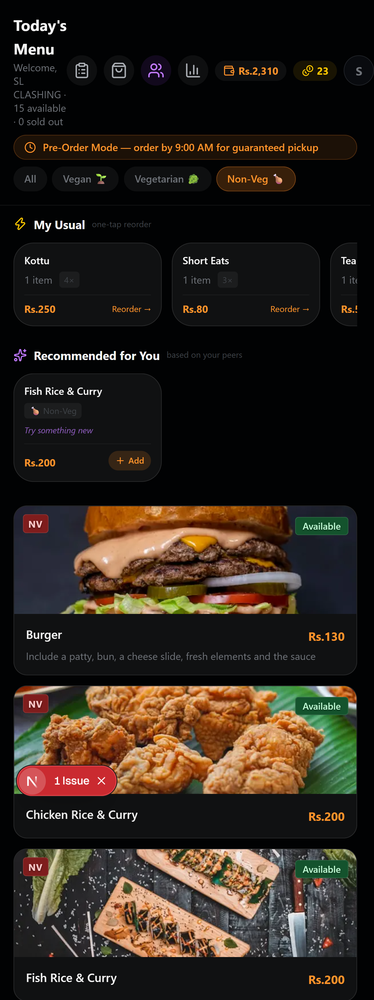
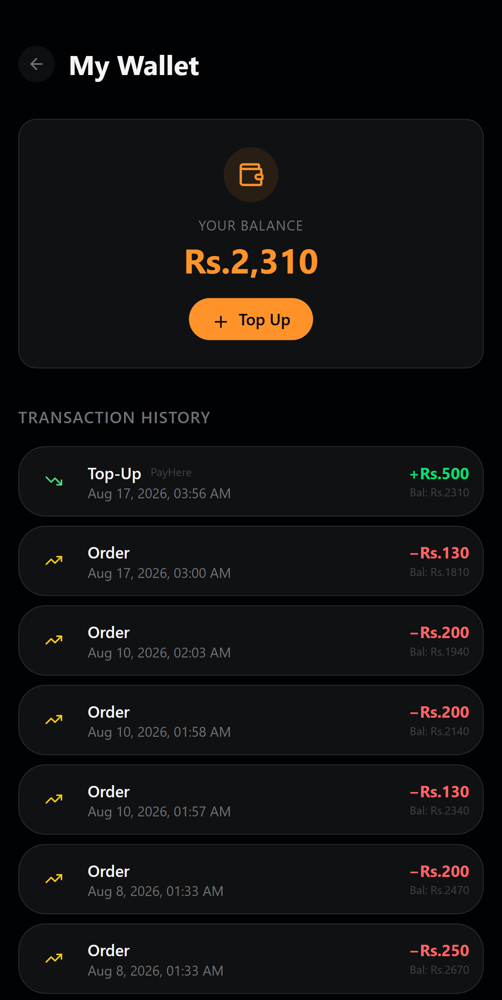
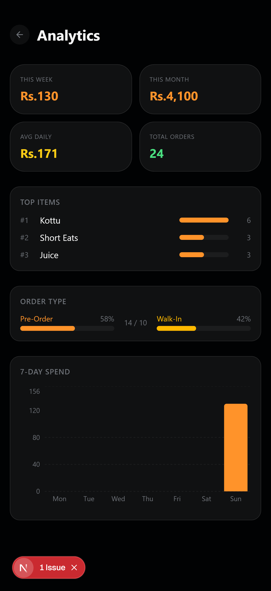
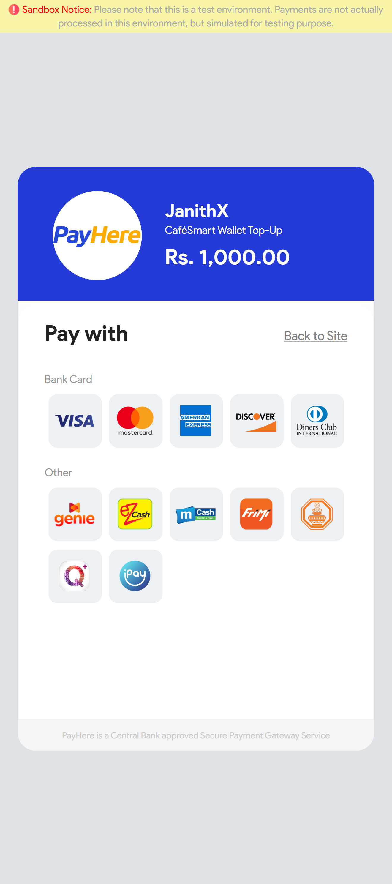
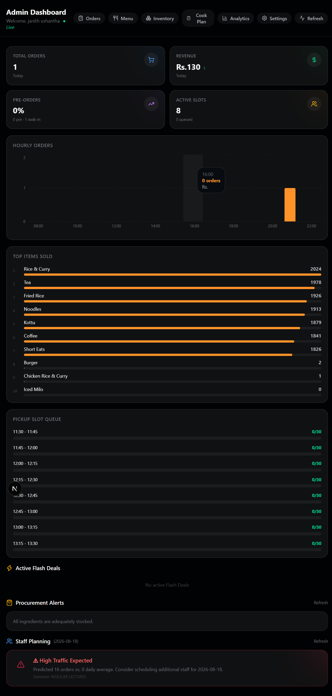
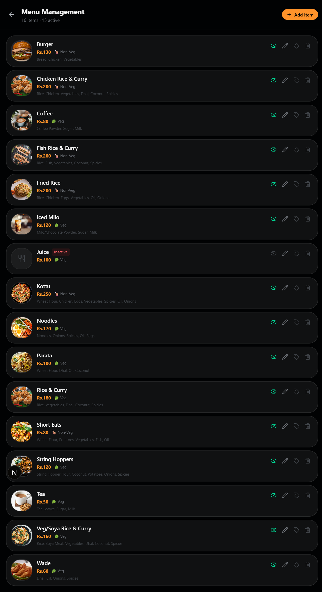
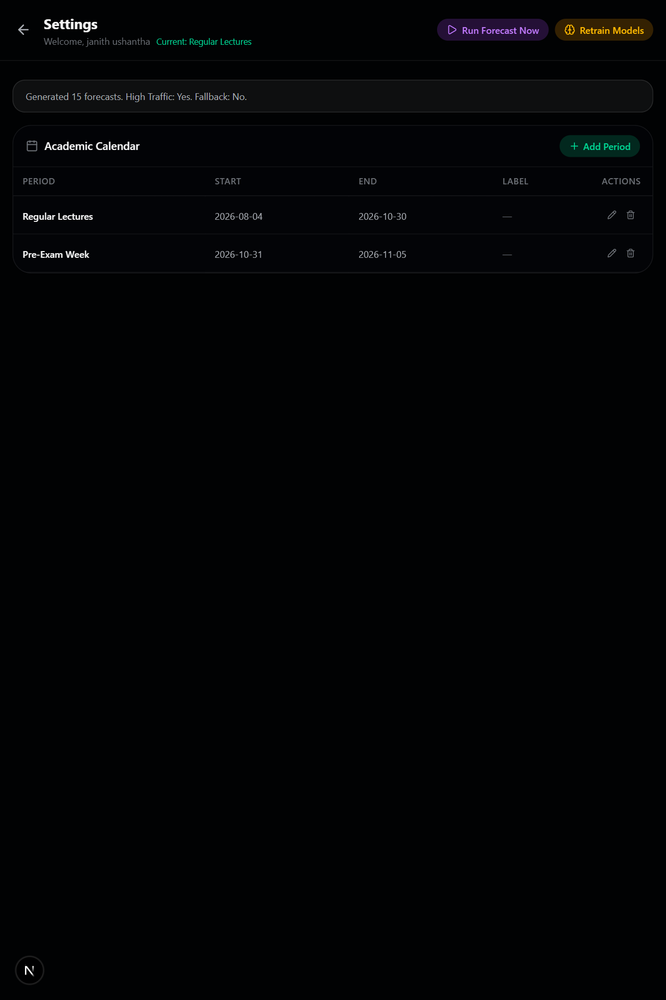
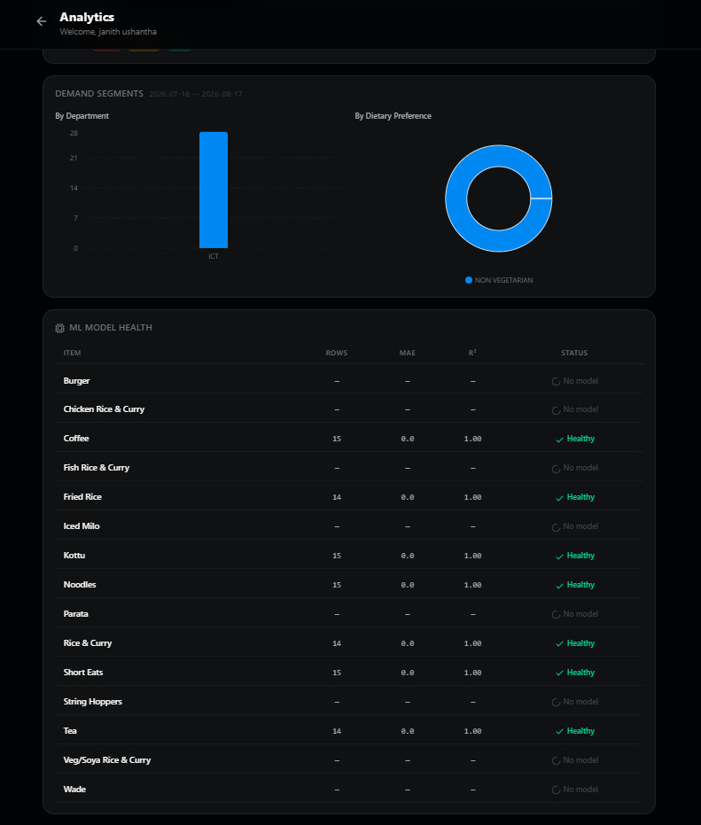
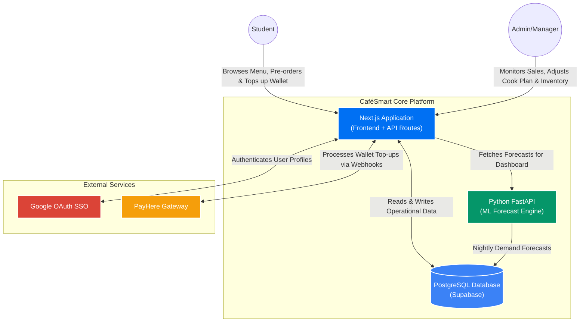

# 🍔 CaféSmart: Smart University Canteen System & ML Forecasting Platform

CaféSmart is a technology-driven web application designed for the Faculty of Technology (FoT), University of Ruhuna canteen, originally authored for the HackTrail hackathon challenge. It transforms traditional canteen operations from a reactive, queue-driven service into a closed-loop intelligent ordering platform. 

By combining mobile-first pre-ordering, a digital wallet system, and a Machine Learning demand forecasting engine, CaféSmart ensures that students never wait in long queues, kitchens never guess their prep amounts, and food wastage is drastically reduced.

---

## 📸 Screenshots

| Student Dashboard | Wallet Topup | Student Analytics | PayHere Sandbox |
| :---: | :---: | :---: | :---: |
|  |  |  |  |


| Admin Dashboard | Admin Dashboard Menu | Admin Dashboard Forecast | Admin Dashboard Analytics |
| :---: | :---: | :---: | :---: |
|  |  |  |  |


---

## 🧠 System Architecture


---  

## ✨ Core Features

### 🎓 For Students
* **Time-Slotted Pre-Orders:** Students can place meal orders before a 9:00 AM daily cutoff and select a specific 15-minute pickup window (e.g., 12:30–12:45) to completely avoid queues.
* **QR Pickup Pass:** Every confirmed order generates a unique QR code valid only for the service date, making collection instant.
* **Canteen Wallet & PayHere Integration:** A closed-loop digital wallet funded via the PayHere gateway. All pre-orders are paid through the wallet.
* **Canteen Coins (Loyalty System)::** Students earn 'Canteen Coins' on wallet top-ups and pre-order spending, which can be redeemed for in-app discounts.
* **Smart Recommendations & Dietary Filters:** The menu adapts to saved dietary preferences (Vegan, Vegetarian, Non-Veg) and suggests items using collaborative filtering.
* **Personal Analytics:** A dashboard showing weekly/monthly spend, top ordered items, and quick reorder ("My Usual") options.

### 👨‍🍳 For Admins & Canteen Managers
* **Live Operational Dashboard:** Real-time visibility into sales, revenue, and queue depth updated via WebSockets.
* **ML-Driven Cook Plan:** A nightly forecast generated by a Python/FastAPI microservice using Linear Regression, predicting exact daily portion requirements per menu item.
* **Smart Flash Discounts:** Automated alerts trigger when an item's sales drop below 30% of the target by 12:30 PM, allowing admins to send push notifications with flash deals to clear surplus.
* **Wastage Heatmap:** A 7-day rolling visual tracker of ingredient waste rates to optimize procurement.
* **Inventory & Procurement Alerts:** Tracks daily stock and generates automated PDF purchase orders when current stock falls below forecasted ML needs.

---

## 🛠️ Technology Stack

| Category | Technologies Used |
| :--- | :--- |
| **Frontend** | Next.js 14 (App Router), React, Tailwind CSS |
| **Backend API** | Next.js API Routes (Node.js) |
| **Machine Learning** | Python, FastAPI, Scikit-Learn, Pandas |
| **Database & ORM** | PostgreSQL (Supabase), Prisma ORM |
| **Authentication** | Auth.js (NextAuth v5) with Google OAuth |
| **Payment Gateway**| PayHere (Sandbox Environment) |

---

## 🚀 Running Locally

This project is optimized for local development and testing. You will need to run both the Next.js application and the Python ML Microservice concurrently.

**Prerequisites:** Node.js ≥ 20, npm ≥ 10, Python ≥ 3.11, PostgreSQL ≥ 14.

### 1. Clone the Repository
```bash
git clone https://github.com/yourusername/Cafesmart-System.git
cd Cafesmart-System
```

### 2. Setup the Next.js Application
```bash
# Install dependencies (also runs `prisma generate` via postinstall)
npm install

# For LOCAL development: push the schema directly to the database
npx prisma db push

# For PRODUCTION deployments: use the committed baseline migration
npx prisma migrate deploy

# Start the development server (boots Next.js + Socket.io + ML schedulers)
npm run dev
```
The Next.js app will run on `http://localhost:3000`.

### 3. Setup the Python ML Microservice
Open a **new terminal window**:
```bash
# Navigate to the ML service directory
cd ml-service

# Create a virtual environment
python -m venv .venv
source .venv/bin/activate  # On Windows use: .venv\Scripts\activate

# Install requirements (now includes pytest + httpx for testing)
pip install -r requirements.txt

# Run the FastAPI server
uvicorn main:app --reload

# Run the ML test suite (optional, requires dev install)
pytest
```
The ML API will run on `http://127.0.0.1:8000`.

## 🧪 Running Tests

```bash
# Vitest unit + component tests
npm test

# With coverage
npm run test:coverage

# Watch mode
npm run test:watch

# ML service tests
npm run ml:test

# Playwright E2E (requires the dev server running)
npm run test:e2e

# All tests (Vitest + Playwright)
npm run test:all
```

## 🐳 Docker

A multi-stage `Dockerfile` is provided for production deployments.

### Quick start (recommended)

```bash
# 1. Bootstrap a `.env` file (copies .env.example, generates AUTH_SECRET,
#    prompts for the few secrets you must fill in by hand)
./scripts/init-env.sh        # Linux/macOS
.\scripts\init-env.ps1        # Windows PowerShell

# 2. Build the image (the bootstrap script can do this for you)
docker build -t cafesmart:latest .

# 3. Run the container, loading secrets from the .env file you just made
docker run --rm -p 3000:3000 -p 8000:8000 --env-file .env cafesmart:latest
```

### Manual start

If you already have a `.env` file with all the required vars:

```bash
docker build -t cafesmart:latest .
docker run --rm -p 3000:3000 -p 8000:8000 --env-file .env cafesmart:latest
```

### Passing env vars inline (no .env file)

```bash
docker run --rm -p 3000:3000 -p 8000:8000 \
  -e DATABASE_URL=postgresql://user:pass@db:5432/cafesmart \
  -e AUTH_SECRET=$(node -e "console.log(require('crypto').randomBytes(32).toString('base64'))") \
  -e AUTH_GOOGLE_ID=... -e AUTH_GOOGLE_SECRET=... \
  -e PAYHERE_MERCHANT_ID=... -e PAYHERE_MERCHANT_SECRET=... \
  -e NEXT_PUBLIC_BASE_URL=http://localhost:3000 \
  -e ML_SERVICE_URL=http://127.0.0.1:8000 \
  cafesmart:latest
```

> **The container's `docker-entrypoint.sh` validates all required env vars
> before booting and prints a clear red error message if anything is missing
> or invalid — so a misconfiguration fails fast instead of producing silent
> 500s from Prisma.**

## 🩺 Troubleshooting

If the build or container fails, see **[docs/TROUBLESHOOTING.md](docs/TROUBLESHOOTING.md)**
for the 8 most common issues (Docker engine not running, missing
`.env`, CRLF line endings in shell scripts, `PrismaClientInitializationError`,
etc.) with copy-paste fixes.

The most common "gotcha" is **`docker build` failing with `got SIGTERM/SIGINT`**
— that's a Docker Desktop issue (the engine isn't running or the
WSL2 backend is broken), **not** a CaféSmart code issue. The
troubleshooting guide has a copy-paste fix.

## ⚙️ CI/CD

GitHub Actions workflows are in `.github/workflows/`:

- `ci.yml` — Lint, typecheck, unit tests, production build, ML pytest
- `docker.yml` — Build & push Docker image to `ghcr.io`

Both run automatically on every push to `main` and on every PR.

---

## ⚙️ Environment Variables (`.env`)

Create a `.env` file in the root of your Next.js project based on the following template:

```env
# Database
DATABASE_URL="your_postgresql_database_url"

# NextAuth Configuration
AUTH_SECRET="generate_a_random_32_character_string"
AUTH_URL="http://localhost:3000"
AUTH_GOOGLE_ID="your_google_client_id"
AUTH_GOOGLE_SECRET="your_google_client_secret"

# PayHere Integration
PAYHERE_MERCHANT_ID="your_payhere_merchant_id"
PAYHERE_MERCHANT_SECRET="your_payhere_merchant_secret"

# Base & Services URLs
NEXT_PUBLIC_BASE_URL="http://localhost:3000" # Use Ngrok/Cloudflare URL if testing PayHere Webhooks
ML_SERVICE_URL="http://127.0.0.1:8000"
```